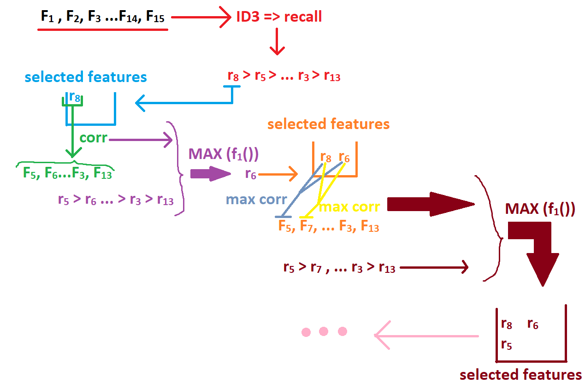
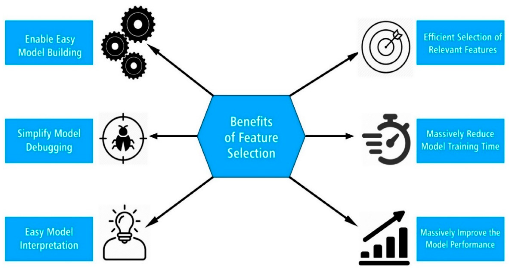
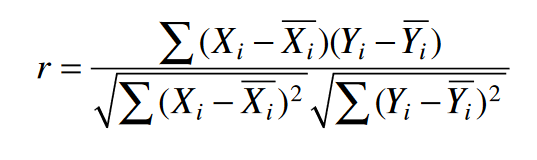
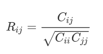
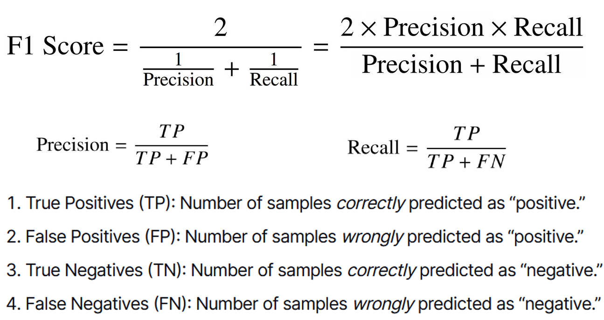
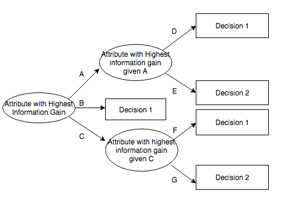

# Epileptic Seizure Detection in EEG Signals

This project explores **epileptic seizure detection from EEG signals** using handcrafted time-domain and frequency-domain features, feature selection, and a hybrid clustering-classification strategy.

The notebook was originally developed as an academic experiment for evaluating EEG features and improving seizure-detection performance with a smaller, more informative feature set.

> **Disclaimer:** This repository is for educational and research purposes only. It is not a medical diagnostic tool.

---

## Project overview

Electroencephalography (EEG) is commonly used to study and diagnose epileptic seizures. This project builds a classical machine-learning pipeline for seizure detection:

1. Load and filter EEG signals.
2. Extract handcrafted statistical and spectral features.
3. Rank individual features using an ID3-style decision tree.
4. Reduce redundancy using Pearson correlation.
5. Select a compact feature subset using an F1-like score that balances feature performance and feature independence.
6. Train Random Forest classifiers.
7. Evaluate whether K-Means segmentation improves classification recall.

---

## Dataset setup

The notebook expects two pickle files in the project root:

```text
x.pkl   # EEG signal matrix
y.pkl   # labels, if available in the original project setup
```

The experiment uses five EEG groups, commonly denoted as:

| Group | Description |
|---|---|
| A | Seizure-free patient recordings from the epileptogenic zone |
| B | Seizure-free patient recordings from the opposite hippocampal formation |
| C | Healthy subjects with eyes closed |
| D | Healthy subjects with eyes open |
| E | Seizure activity |

In the main binary experiment, groups **A, B, C, and D** are treated as non-seizure samples, and group **E** is treated as seizure activity.

---

## Methodology

### 1. Signal filtering

The EEG signals are filtered using a third-order Butterworth band-pass filter:

```python
sampling_freq = 173.6
b, a = butter(3, [0.5, 40], btype="bandpass", fs=sampling_freq)
```

This keeps the signal components between **0.5 Hz and 40 Hz**.

### 2. Feature extraction

The notebook extracts **26 handcrafted features** from each EEG signal.

**Time-domain features** include:

`Min`, `Max`, `Mean`, `Rms`, `Var`, `Std`, `mean_square`, `Peak`, `Skew`, `Kurtosis`, `P2p`, `CrestFactor`, `FormFactor`, `PulseIndicator`, `ShapeFactor`, `MAbs`, `Smr`, `ImpulseFactor`, and `ClearanceFactor`.

**Frequency-domain features** include:

`Max_f`, `Sum_f`, `Mean_f`, `Var_f`, `Peak_f`, `Skew_f`, and `Kurtosis_f`.

All features are standardized with `StandardScaler` before model evaluation.

### 3. Feature scoring

Each feature is first evaluated independently using a decision tree classifier and 5-fold cross-validation recall.

The strongest single-feature recall scores in the notebook were:

| Feature | Recall |
|---|---:|
| Var | 0.9072 |
| Std | 0.9072 |
| mean_square | 0.9072 |
| Mean_f | 0.9072 |
| Sum_f | 0.9072 |
| Rms | 0.9072 |

### 4. Redundancy reduction with correlation

Pearson correlation is used to measure similarity between features. Highly correlated features are treated as redundant, while lower-correlation features are preferred because they add more independent information.

The selection score combines:

- the feature's standalone recall, and
- its independence from already selected features.

The combination is based on a harmonic-mean / F1-style score:

$$
F1 = \frac{2 \times \text{Recall} \times (1 - \max |corr|)}{\text{Recall} + (1 - \max |corr|)}
$$

### 5. Final selected feature subset

Using the feature-selection algorithm, the notebook selected **10 features**:

| # | Selected feature |
|---:|---|
| 1 | Var |
| 2 | Skew |
| 3 | Kurtosis |
| 4 | Mean |
| 5 | Skew_f |
| 6 | PulseIndicator |
| 7 | Var_f |
| 8 | Max |
| 9 | CrestFactor |
| 10 | ShapeFactor |

This 10-feature subset reached a reported **5-fold recall of 0.9511** with a Random Forest classifier.

---

## Feature-selection workflow

<p align="center">
  
</p>

The algorithm can be summarized as:

1. Rank all features by standalone ID3/Decision Tree recall.
2. Select the best standalone feature first.
3. For every remaining feature, compute its maximum absolute correlation with already selected features.
4. Convert redundancy into an independence score using `1 - max(abs(correlation))`.
5. Combine independence and recall using an F1-like score.
6. Add the feature with the highest combined score.
7. Evaluate the selected subset with Random Forest and 5-fold cross-validation.

---

## Clustering + classification experiment

After feature selection, the project evaluates whether segmenting the feature space with **K-Means** can improve classification.

The idea is:

1. Split the selected-feature data into train and test sets.
2. Cluster the training data with K-Means.
3. Train one Random Forest classifier per cluster.
4. Assign test samples to clusters.
5. Evaluate the weighted recall across clusters.

### Main binary seizure-detection result

| K-Means clusters | Reported average recall |
|---:|---:|
| 1, no clustering | 0.9231 |
| 2 | **0.9599** |
| 3 | 0.9595 |
| 4 | 0.9595 |
| 5 | 0.8816 |
| 6 | 0.8841 |

The best reported result was with **K = 2**, improving recall from **0.9231** to **0.9599**.

---

## Additional experiments

The notebook also evaluates the selected features and clustering strategy on other EEG classification problems.

| Problem | Best reported setting | Best reported recall | Comment |
|---|---|---:|---|
| A + B vs E | No clustering | 0.9474 | Clustering did not improve recall. |
| C + D vs E | No clustering / K = 2 / K = 3 | 1.0000 | Already reached perfect recall. |
| A + B vs C + D | K = 5 | 0.8028 | Clustering improved over 0.7143 baseline. |
| A + B vs C + D vs E | No clustering | 0.8400 | Clustering reduced performance. |

---

## Repository structure

Suggested project structure:

```text
.
├── experiments.ipynb
├── x.pkl
├── y.pkl
├── README.md
└── assets/
    └── readme/
        ├── fs_filter.png
        ├── fs_adv.png
        ├── Untitled.png
        ├── corr.png
        ├── corroef_f.png
        ├── f1-s.png
        ├── id3.png
        ├── id3-Ent.png
        ├── id3-IG.png
        ├── id3-IG2.png
        └── Recall.png
```

---

## Installation

Create a Python environment and install the required packages:

```bash
pip install numpy pandas scipy scikit-learn matplotlib seaborn jupyter
```

Then start Jupyter:

```bash
jupyter notebook
```

Open:

```text
experiments.ipynb
```

---

## How to run

1. Place `x.pkl` and `y.pkl` in the project root.
2. Open `experiments.ipynb`.
3. Run the notebook cells in order:
   - imports and random seed setup,
   - data loading and filtering,
   - feature extraction,
   - feature selection,
   - clustering/classification experiments,
   - additional classification problems.

---

## Key findings

- A compact subset of **10 features** achieved strong seizure-detection recall.
- Variance-related features were highly informative but also strongly correlated with many other features.
- Features such as `Skew`, `Mean`, and `Skew_f` helped because they added less redundant information.
- K-Means segmentation improved recall in the main binary seizure-detection task, with the best reported result at **K = 2**.
- Clustering did not consistently improve all classification problems, so it should be treated as a task-dependent enhancement.

---

## Important implementation note

Before using the clustering results as final benchmark numbers, re-check the test-cluster assignment logic in the notebook. In the clustering loop, test samples should be assigned using the K-Means predictions for the test set, not the training labels. The intended condition is:

```python
if y_labels_test[j] == i:
    x_test_clusterd[i].append(x_test[j, :])
    y_test_clusterd[i].append(y_test[j, :])
```

This makes the reported clustering results more reliable and easier to reproduce.

---

## Future improvements

- Refactor the notebook into reusable Python modules.
- Add a `requirements.txt` file.
- Add automated experiments for different random seeds.
- Report precision, F1-score, confusion matrix, and ROC-AUC in addition to recall.
- Compare Random Forest with SVM, KNN, Logistic Regression, XGBoost, and neural approaches.
- Save selected features and trained models for reproducible inference.

---

## Visual notes

<details>
<summary>Additional diagrams used in the notebook</summary>

### Feature selection as filtering

<p align="center">
  
</p>

### Benefits of feature selection

<p align="center">
  
</p>

### Pearson correlation

<p align="center">
  
</p>

### Correlation coefficient matrix relation

<p align="center">
  
</p>

### F1 score, precision, and recall

<p align="center">
  
</p>

### ID3 decision-tree idea

<p align="center">
  
</p>

</details>
